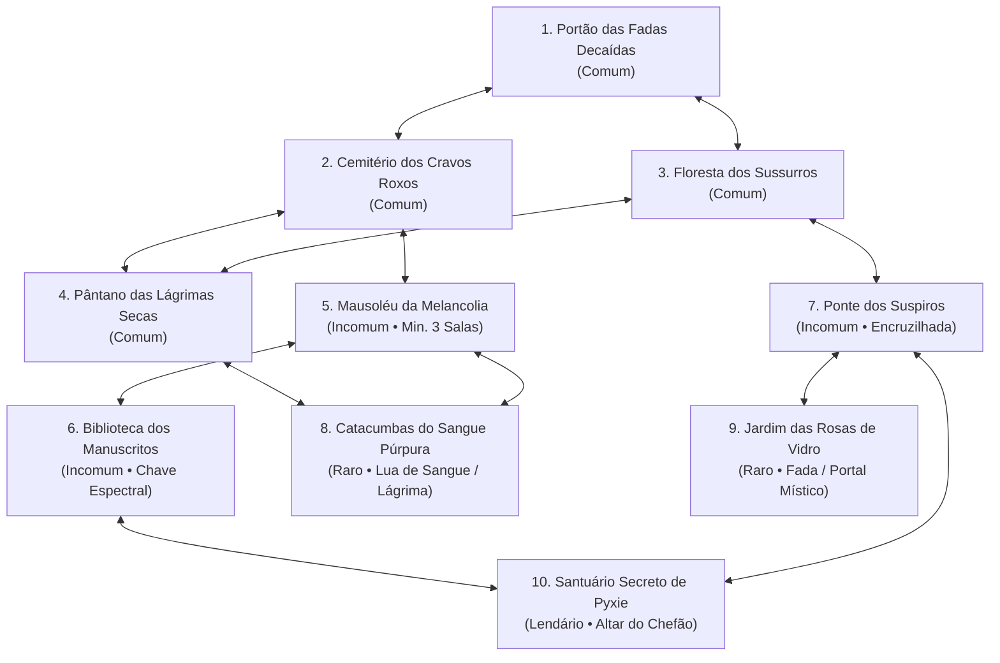

# 🌲 Bosque da Pyxie (Pyxie's Grove) — Documentação Técnica & Guia do Módulo

O **Bosque da Pyxie** (*Pyxie's Grove*) é um minigame RPG de exploração gótica, captura/negociação de espíritos e chefão comunitário construído diretamente no ecossistema Discord da **Pyxie** (`botMelody`).

Inspirado nos clássicos de GBA (*Shin Megami Tensei: DemiKids*, *Castlevania: Aria of Sorrow* e RPG Maker), o módulo foi projetado para engajar servidores de qualquer porte — inclusive comunidades com poucos membros ativos — através de **mecânicas assíncronas**, navegação interativa por botões e **zero uso de bibliotecas gráficas pesadas** (sem `node-canvas`), garantindo consumo de memória inferior a 100 MB na VM.

---

## 🧭 Sumário
1. [Visão Geral & Diretrizes de Design](#1-visão-geral--diretrizes-de-design)
2. [Comandos Oficiais & Aliases](#2-comandos-oficiais--aliases)
3. [Economia Própria & Vigor (Energia)](#3-economia-própria--vigor-energia)
4. [Topologia dos 10 Cenários Pixel 16-Bit](#4-topologia-dos-10-cenários-pixel-16-bit)
5. [Ciclo de Marés Místicas (6 Horas)](#5-ciclo-de-marés-místicas-6-horas)
6. [Sistema Atlus/DemiKids de Negociação](#6-sistema-atlusdemikids-de-negociação)
7. [Grimório, Familiares & Auras Passivas](#7-grimório-familiares--auras-passivas)
8. [Caldeirão de Fusão de Almas (Soul Fusion)](#8-caldeirão-de-fusão-de-almas-soul-fusion)
9. [Rastros Sociais Assíncronos (Giz Roxo)](#9-rastros-sociais-assíncronos-giz-roxo)
10. [Chefão Comunitário & Bônus Patrocinado de 10s](#10-chefão-comunitário--bônus-patrocinado-de-10s)
11. [Arquitetura Técnica & Sincronização Multi-Processo](#11-arquitetura-técnica--sincronização-multi-processo)

---

## 1. Visão Geral & Diretrizes de Design

- **Estética Dark Fantasy Emo**: A identidade visual gira em torno de névoas lilases, fadas melancólicas, toucas pretas, corvos shoegaze e humor sarcástico adolescente.
- **Zero Overhead Gráfico (`node-canvas` Free)**: Todas as salas utilizam ilustrações estáticas em pixel art 16-bit salvas na pasta `assets/locations/`. As imagens são enviadas diretamente nos embeds do Discord como `AttachmentBuilder`, mantendo a CPU da máquina virtual em ~0%.
- **Paridade Bilíngue Estrita (PT-BR & EN)**: Todos os diálogos, nomes de espíritos, descrições de cenários, auras, embeds e botões possuem versões gêmeas em português brasileiro e inglês em `src/utils/i18n.js`.
- **Globalidade Total**: Não há referências a termos locais ou privados da Cringelândia dentro das histórias ou desafios deste módulo, preservando a elegibilidade global do bot para plataformas como Top.gg.

---

## 2. Comandos Oficiais & Aliases

O módulo é registrado no catálogo oficial sob a categoria **`bosque`** e oferece dois comandos principais com suporte a Slash Commands (`/`) e Prefixo de Texto (`py!`):

| Comando Slash | Comando Prefixo | Aliases Suportados | Descrição |
| :--- | :--- | :--- | :--- |
| `/py-explore` | `py!explorar` | `py!explore`, `py!gloom`, `py!bosque`, `py!py-bosque` | Abre o painel do cenário atual, permitindo farejar recursos, mover-se pelo grafo, deixar rastros e apaziguar o Chefão. |
| `/py-grimorio` | `py!grimorio` | `py!grimoire`, `py!py-grimorio`, `py!py-grimoire` | Abre a coleção de espíritos, gerenciamento de auras de familiares ativos e acesso ao Caldeirão de Fusão. |

---

## 3. Economia Própria & Vigor (Energia)

Para evitar inflação cruzada com o sistema monetário do servidor, o Bosque possui sua própria base monetária e temporizadores de ação:

### 👻 Phantom Coins (`phantomCoins`)
- É a moeda exclusiva do reino místico, armazenada separadamente em `data/gloom.json`.
- **Como Obter**:
  - Farejando nos cenários (recompensa de 8 a 35 Phantom Coins por tentativa).
  - Vencendo negociações de diálogo com espíritos (+20 a +30 👻).
  - Desferindo investidas contra o Chefão Comunitário (+35 👻 por ataque).
  - Resgatando o bônus patrocinado de 10 segundos no portal web (+50 👻).
- **Onde Gastar**:
  - Subornando espíritos difíceis em vez de adivinhar o diálogo.
  - Realizando fusão de almas no Caldeirão (30 👻 por ritual).
  - Gravando rastros de giz roxo para outros jogadores (15 👻 base + oferendas).

### ⚡ Sistema de Vigor (10 Ações por Hora)
- Cada jogador possui uma barra de energia com capacidade máxima de **10 pontos**.
- Cada forrageamento/farejamento consome **1 ponto**.
- **Taxa de Regeneração**: 1 ponto recuperado a cada **6 minutos** (`ENERGY_REGEN_MS = 360.000 ms`), permitindo um ciclo constante de 10 ações por hora.
- Familiares com a aura passiva de economia de energia possuem 15% de chance de executar o forrageamento **sem gastar vigor**.

---

## 4. Topologia dos 10 Cenários Pixel 16-Bit

O reino é modelado computacionalmente como um **Grafo Direcionado com Restrições (`GloomGraph`)**, onde cada nó representa uma localidade estática com tabela de loot própria, espíritos nativos e condições especiais de travessia:



### Catálogo Completo dos Cenários

| # | ID do Cenário | Nome (PT / EN) | Imagem Anexa | Condição de Acesso | Loot & Recursos |
| :-: | :--- | :--- | :--- | :--- | :--- |
| **1** | `portao_penumbra` | Portão das Fadas Decaídas<br>*Gates of the Fallen* | `portao_penumbra.png` | **Livre** (Ponto de partida) | Phantom Coins (8-20), Cravo Negro, Fragmento de Lápide. |
| **2** | `cemiterio_espinhos` | Cemitério dos Cravos Roxos<br>*Thorn Graveyard* | `cemiterio_espinhos.png` | **Livre** (Adjacente ao Portão) | Phantom Coins (10-25), Cravo Negro, Lágrima Emo, Chave Espectral (5%). |
| **3** | `floresta_sussurros` | Floresta dos Sussurros<br>*Whispering Woods* | `floresta_sussurros.png` | **Livre** (Adjacente ao Portão) | Phantom Coins (10-22), Cogumelo Violeta, Corda Rompida de Guitarra. |
| **4** | `pantano_lagrimas` | Pântano das Lágrimas Secas<br>*Swamp of Dry Tears* | `pantano_lagrimas.png` | **Livre** (Adjacente à Floresta/Cemitério) | Phantom Coins (12-28), Lágrima Emo, Ramo de Espinho Seco. |
| **5** | `mausoleu_ancestral` | Mausoléu da Melancolia<br>*Mausoleum of Melancholy* | `mausoleu_ancestral.png` | Ter visitado pelo menos **3 localidades**. | Phantom Coins (15-30), Lápide Ancestral, Chave Espectral (15%). |
| **6** | `biblioteca_esquecida`| Biblioteca dos Manuscritos<br>*Library of Forgotten Tomes* | `biblioteca_esquecida.png`| Possuir **1x Chave Espectral** no inventário do minigame. | Phantom Coins (18-35), Pergaminho Sombrio, Tinteiro Violeta. |
| **7** | `ponte_abismo` | Ponte dos Suspiros<br>*Bridge of Sighs* | `ponte_abismo.png` | **Livre** (15% de chance ao farejar de abrir portal para o Jardim). | Phantom Coins (15-32), Pedra do Abismo, Fragmento Roxo. |
| **8** | `catacumba_sangue_roxo`| Catacumbas do Sangue Púrpura<br>*Catacombs of Purple Blood* | `catacumba_sangue_roxo.png`| Maré **Lua de Sangue Roxo** OU possuir **1x Lágrima Emo**. | Phantom Coins (25-45), Frasco de Sangue Violeta, Amuleto Antigo. |
| **9** | `jardim_fadas_negras` | Jardim das Rosas de Vidro<br>*Garden of Glass Roses* | `jardim_fadas_negras.png` | Ter familiar **Fada** equipado OU fenda mística da Ponte aberta. | Phantom Coins (20-40), Pétala de Rosa de Vidro, Essência de Fada. |
| **10**| `santuario_touca_preta` | Santuário Secreto de Pyxie<br>*Pyxie's Secret Shrine* | `santuario_touca_preta.png`| Ter participado de **pelo menos 1 ataque ao Chefão** no ciclo atual. | Phantom Coins (35-60), Touca em Miniatura, Relíquia da Fadinha. |

---

## 5. Ciclo de Marés Místicas (6 Horas)

A cada **6 horas contínuas** (`TIDE_CYCLE_MS = 21.600.000 ms`), o clima espiritual do Bosque se altera de forma determinística baseada no tempo UNIX global:

1. 🟣 **Lua de Sangue Roxo (`purple_moon`)**:
   - Destranca automaticamente as *Catacumbas do Sangue Púrpura* sem exigir consumo de Lágrima Emo.
   - Aparições de Tier 3 e Tier 4 têm o dobro de probabilidade de surgirem nos encontros.
2. 🟢 **Nevoeiro Ácido (`acid_fog`)**:
   - As chances de obtenção de itens raros e chaves nas tabelas de loot sobem em 100%.
3. 🔵 **Vento Silencioso (`silent_wind`)**:
   - Todas as recompensas de Phantom Coins ao forragear e farejar são **multiplicadas por 2x**.
4. 🌸 **Lua da Melancolia Emo (`emo_moon`)**:
   - Os espíritos ficam sentimentais e empáticos; os custos de suborno em moedas caem em 30%.

---

## 6. Sistema Atlus/DemiKids de Negociação

Durante o forrageamento em qualquer cenário, há **35% de probabilidade** de uma aparição surgir das sombras. O jogador entra imediatamente em uma tela de diálogo interativa no estilo *Shin Megami Tensei / DemiKids*:

```
                         [ Aparição Surge ]
                                 │
         ┌───────────────────────┼───────────────────────┐
         ▼                       ▼                       ▼
    [ Sagacidade ]          [ Suborno 💰 ]          [ Fuga 🏃 ]
         │                       │                       │
  3 Opções de Fala         Paga taxa em 👻        Retorna à sala
  (1 correta, 2 erradas)   (Pacto Garantido)      sem perdas
         │                       │
 ┌───────┴───────┐               │
 ▼               ▼               │
[ Acerto ]     [ Erro ]          │
Pacto Feito    Espírito foge     │
+ Moedas 👻                      │
         └───────────────┬───────┘
                         ▼
             [ Espírito no Grimório ]
```

### Roster dos 14 Espíritos Catalogados

#### Tier 1 — Comum
- 👻 **Espectro do Baixo Astral** (`espectro_baixo_astral`): Fantasma melancólico que suspira o tempo todo.  
  *Aura*: +10% de moedas ao forragear.
- 🗿 **Gárgula Procrastinador** (`gargula_procrastinador`): Monólito de pedra gótico que adia qualquer combate.  
  *Aura*: 15% de chance de economizar vigor ao explorar.
- 🧚‍♀️ **Fada Desencantada** (`fada_desencantada`): Fadinha que perdeu o brilho e ouve punk rock.  
  *Aura*: Concede afinidade de fada (desbloqueia o Jardim das Rosas).
- 🦇 **Morcego do Shoegaze** (`morcego_shoegaze`): Morceguinho com franja cobrindo os olhos.  
  *Aura*: +5% de moedas ao forragear.

#### Tier 2 — Incomum
- 🐦 **Corvo Poeta Nihilista** (`corvo_poeta`): Escreve sonetos obscuros nas árvores da floresta.  
  *Aura*: +15% de dano contra o Chefão Comunitário.
- 🎙️ **Banshee do Fone Descarregado** (`banshee_descarregada`): Chora copiosamente porque a bateria do fone acabou.  
  *Aura*: Reduz em 20% o custo de Phantom Coins para gravar rastros.
- 🐺 **Lobisomem Introvertido** (`lobisomem_introvertido`): Não uiva para a lua cheia para não incomodar ninguém.  
  *Aura*: +10% de resistência/dano no Chefão.
- 💀 **Esqueleto de All-Star** (`esqueleto_allstar`): Ossada estilosa com tênis surrados e posture emo.  
  *Aura*: 20% de chance de forrageamento rápido.

#### Tier 3 — Raro
- 👑 **Lorde da Apatia** (`lorde_apatia`): Entidade nobre que simplesmente não se importa com nada.  
  *Aura*: +25% de Phantom Coins em qualquer atividade.
- 🦁 **Quimera da Madrugada** (`quimera_madrugada`): Criatura híbrida que ganha força entre meia-noite e 06:00.  
  *Aura*: +25% de dano contra o Chefão.
- 🗡️ **Cavaleiro da Névoa Violeta** (`cavaleiro_nevoa`): Paladino caído com armadura roxa brilhante.  
  *Aura*: +30% de dano em ataques físicos.
- 🍷 **Súcubo do Tédio** (`sucubo_tedio`): Demônio que se alimenta de bocejos e tédio alheio.  
  *Aura*: +20% de moedas ao forragear.

#### Tier 4 — Lendário
- 🔥 **Fênix de Cinzas Frias** (`fenix_cinzas`): Pássaro lendário que renasce de brasas frias e lágrimas lilases.  
  *Aura*: +40% de Phantom Coins gerais e +35% de dano no Chefão.
- 🌑 **Sombra Ancestral da Meia-Noite** (`sombra_ancestral`): A manifestação primordial da escuridão do Bosque.  
  *Aura*: Concede +50% de dano máximo em investidas contra o Colosso.

---

## 7. Grimório, Familiares & Auras Passivas

Ao usar o comando `/py-grimorio`, o aventureiro visualiza sua biblioteca de almas:
- **Equipar Familiares**: Cada jogador pode manter até **2 espíritos equipados** simultaneamente nos slots ativos.
- **Acúmulo de Auras**: As habilidades dos familiares equipados funcionam de forma passiva permanente enquanto vinculados (ex: equipar *Fada Desencantada* + *Lorde da Apatia* concede passagem livre para o Jardim de Vidro e +25% de moedas em todas as explorações).
- **Gerenciamento Amigável**: Botões interativos de *Vincular* e *Desvincular* no próprio embed.

---

## 8. Caldeirão de Fusão de Almas (Soul Fusion)

Acessível pelo botão do Grimório ao custo de **30 Phantom Coins** por operação. O sistema implementa duas vias de fusão direta:

### A. Fusão Pura (Pure Blood)
Funde **2 cópias idênticas** do mesmo espírito para criar uma entidade de Tier superior:
- `2x Espectro do Baixo Astral` ➔ **Lorde da Apatia** (Tier 3)
- `2x Morcego do Shoegaze` ➔ **Cavaleiro da Névoa Violeta** (Tier 3)
- `2x Fada Desencantada` ➔ **Súcubo do Tédio** (Tier 3)

### B. Fusão Cruzada (Mixed Blood — Fórmulas Específicas)
Combina espécies distintas para forjar monstros lendários:
- `Corvo Poeta Nihilista` + `Gárgula Procrastinador` ➔ **Quimera da Madrugada** (Tier 3)
- `Esqueleto de All-Star` + `Lobisomem Introvertido` ➔ **Cavaleiro da Névoa Violeta** (Tier 3)
- `Fada Desencantada` + `Banshee do Fone Descarregado` ➔ **Súcubo do Tédio** (Tier 3)
- `Cavaleiro da Névoa Violeta` + `Quimera da Madrugada` ➔ **Fênix de Cinzas Frias** (Tier 4 Lendário)

---

## 9. Rastros Sociais Assíncronos (Giz Roxo)

Projetado especificamente para servidores onde os membros não jogam ao mesmo tempo:
- Ao entrar em qualquer cenário, o jogador pode clicar em **✍️ Deixar Rastro**.
- Abre um modal de texto permitindo digitar uma dica, frase melancólica, aviso de perigo ou poesia gótica de até 120 caracteres.
- **Oferenda Opcional**: O jogador pode anexar uma quantia voluntária de Phantom Coins que ficará registrada na pedra para inspirar a comunidade.
- **Custo**: 15 Phantom Coins base (+ a quantia da oferenda).
- **Exibição Dinâmica**: Cada sala retém os **5 rastros mais recentes** daquele servidor. Ao explorar, novos jogadores leem os recados deixados pelos amigos com nome de autor e data.

---

## 10. Chefão Comunitário & Bônus Patrocinado de 10s

No coração do Bosque habita **A Sombra do Tédio Ancestral** (*The Ancient Gloom Behemoth*), um World Boss colaborativo com vida compartilhada por todo o servidor:

```
[ Vida do Colosso: 3000 / 3000 HP ]
[ Ciclo Atual de 6 Horas ]
```

### Dinâmica das Investidas
1. **1ª Investida Gratuita**:
   - Todo jogador tem direito a 1 investida gratuita a cada ciclo de 6 horas.
   - Desfere entre **50 a 100 de dano** à barra de vida global do Chefão.
   - Recompensa imediatamente **+35 Phantom Coins 👻**.
   - Concede a credencial de apaziguamento que libera a entrada no *Santuário Secreto de Pyxie*.
2. **Tentativa de 2º Ataque no Mesmo Ciclo**:
   - O botão de ataque é bloqueado por cooldown temporário.
   - O embed oferece o botão **📺 Assistir Bônus 10s (Investida Extra)**.
3. **Fluxo do Bônus Web Patrocinado (10 Segundos)**:
   - Ao clicar no link, uma sessão HMAC exclusiva e assinada (`gloom_boss`) é aberta no navegador.
   - A página `bonus.html` exibe a contagem regressiva de 10 segundos com banners de monetização e estética temática do Bosque.
   - Ao resgatar, o jogador recebe **estritamente**:
     - ✅ **1x Investida Extra contra o Chefão**
     - ✅ **+50 Phantom Coins 👻**
     - 🚫 **Zero poluição de economia**: nenhuma moeda convencional, baú ou feijão mágico da economia padrão é concedido neste fluxo.
4. **Botão de Atualização Instantânea no Discord**:
   - O embed do Chefão inclui o botão **`🔄 Já assisti / Atualizar`**.
   - Ao concluir no navegador, o usuário não precisa fechar nada no Discord: basta tocar em *Atualizar* e o botão transforma-se imediatamente em **`⚔️ Investida Extra Desbloqueada!`**.

---

## 11. Arquitetura Técnica & Sincronização Multi-Processo

### Armazenamento e Tolerância a Falhas
- Arquivo principal: `data/gloom.json`.
- Cópia de segurança atômica: `data/gloom.json.bak`.
- Escritas atômicas realizadas via arquivo temporário com PID e timestamp (`fs.renameSync`) para prevenir arquivos corrompidos em caso de reinicialização abrupta.

### Sincronização Multi-Processo (`mtimeMs`)
Na infraestrutura de produção, o sistema opera com dois processos Node.js:
1. **Processo Pai (`server.js`)**: Servidor Express que atende as rotas web (`/bonus`, `/api/bonus/claim`, etc.).
2. **Processo Filho (`index.js`)**: Bot Discord que processa as mensagens e interações de botões.

Para garantir que o desbloqueio da investida feito na web seja reconhecido instantaneamente pelo bot do Discord, o método `readGloomData()` compara o carimbo de tempo do arquivo no disco (`stat.mtimeMs`) com o cache em memória. Caso o servidor web grave uma alteração, o bot invalida seu cache automaticamente e lê os dados atualizados sem qualquer latência ou necessidade de reinicialização.

---

## 12. Quality Gate & Cobertura de Testes Automatizados

Todas as mecânicas descritas neste guia são verificadas e auditadas por testes unitários contínuos no comando `npm test`:
- `tests/gloomRealm.test.js`: Validação dos 10 cenários, nós do grafo, 14 espíritos, negociação Atlus, caldeirão de fusão, taxa de regeneração de energia, rastros de giz roxo, vida do Chefão e invalidação de cache `mtimeMs`.
- `tests/bonusTimer.test.js`: Auditoria de HMAC, anti-replay, tempo mínimo de 10s e garantia de que o bônus de `gloom_boss` não afeta moedas da economia padrão.
- `tests/i18nParity.test.js`: Auditoria recursiva de paridade bilíngue estrita (PT/EN) em 100% das chaves e parâmetros dinâmicos do módulo `bosque`.
